# Nova Discord Bot - Full Flowchart

## System Architecture

```mermaid
flowchart TB
    subgraph External["External Services"]
        DiscordAPI["Discord API"]
        GeminiAPI["Google Gemini API"]
        GroqAPI["Groq API"]
        TavilyAPI["Tavily API"]
        HyperbrowserAPI["Hyperbrowser API"]
        BrowserlessAPI["Browserless API"]
        GitHubAPI["GitHub API"]
        myQuranAPI["myQuran API"]
        AlAdhanAPI["AlAdhan API"]
    end

    subgraph BotCore["Bot Core"]
        Main["main.py"]
        Bot["core/bot.py"]
        EventHandler["core/event_handler.py"]
        MessageRouter["core/message_router.py"]
        ContextBuilder["core/context_builder.py"]
    end

    subgraph Services["Services Layer"]
        GeminiClient["services/gemini_client.py"]
        GroqClient["services/groq_client.py"]
        TavilyClient["services/tavily_client.py"]
        HyperbrowserClient["services/hyperbrowser_client.py"]
        BrowserlessClient["services/browserless_client.py"]
        SholatClient["services/sholat_client.py"]
        ToolExecutor["services/tool_executor.py"]
        TokenCounter["services/token_counter.py"]
    end

    subgraph Memory["Memory Layer"]
        SessionManager["memory/session_manager.py"]
        HistoryStore["memory/history_store.py"]
        RagStore["memory/rag_store.py"]
        CompactionEngine["memory/compaction_engine.py"]
        AuditLogger["memory/audit_logger.py"]
        MentionStore["memory/mention_store.py"]
        GitHubBackup["memory/github_backup.py"]
        ScheduledJobs["memory/scheduled_jobs.py"]
    end

    subgraph Handlers["Message Handlers"]
        MessageHandler["handlers/message_handler.py"]
        MessageCache["handlers/message_cache.py"]
        AttachmentProcessor["handlers/attachment_processor.py"]
        FileProcessor["handlers/file_processor.py"]
        FactExtractor["handlers/fact_extractor.py"]
    end

    subgraph Cogs["Cogs (Discord Commands)"]
        AICogs["cogs/ai_commands.py"]
        AdminCogs["cogs/admin_commands.py"]
        DynamicPresence["cogs/dynamic_presence.py"]
        SlashCommands["cogs/slash_commands.py"]
        VoiceCog["cogs/voice.py"]
        SholatCog["cogs/sholat.py"]
    end

    subgraph Config["Configuration"]
        Settings["config/settings.py"]
        Personality["config/prompts/personality.txt"]
        Prefixes["config/prefixes.json"]
    end

    Main --> Bot
    Main --> Services
    Main --> Memory
    Main --> Handlers
    Main --> Cogs
    Main --> Config

    Bot --> DiscordAPI
    Bot --> EventHandler
    Bot --> MessageRouter

    GeminiClient --> GeminiAPI
    GroqClient --> GroqAPI
    TavilyClient --> TavilyAPI
    HyperbrowserClient --> HyperbrowserAPI
    BrowserlessClient --> BrowserlessAPI
    GitHubBackup --> GitHubAPI
    SholatClient --> myQuranAPI
    SholatClient --> AlAdhanAPI

    ToolExecutor --> GeminiClient
    ToolExecutor --> GroqClient
    ToolExecutor --> TavilyClient
    ToolExecutor --> HyperbrowserClient
    ToolExecutor --> BrowserlessClient

    MessageHandler --> AttachmentProcessor
    MessageHandler --> FileProcessor
    MessageHandler --> FactExtractor
    MessageHandler --> ToolExecutor

    SlashCommands --> ToolExecutor
    SlashCommands --> AuditLogger
```

## Message Processing Flow

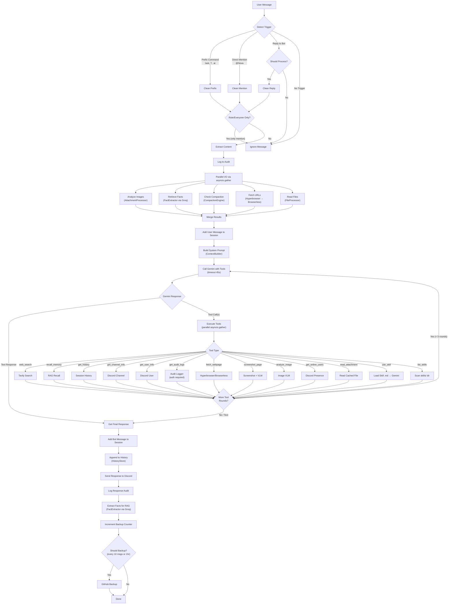

## Slash Commands Flow

```mermaid
flowchart TD
    subgraph Commands["Slash Commands"]
        Ask["/ask"]
        Recall["/recall"]
        History["/history<br/>(manage_messages)"]
        Forget["/forget<br/>(manage_messages)"]
        Deleted["/deleted<br/>(manage_messages)"]
        Audit["/audit<br/>(manage_messages)"]
        Send["/send<br/>(manage_messages)"]
        Welcome["/welcome<br/>(manage_messages)"]
        OptIn["/optin"]
        OptOut["/optout"]
        MyStatus["/mystatus"]
        Analyze["/analyze"]
        Screenshot["/screenshot"]
        Read["/read"]
        Afk["/afk"]
        Unafk["/unafk"]
        Sholat["/sholat"]
        SholatKiblat["/sholat-kiblat"]
        SholatStatus["/sholat-status<br/>(admin)"]
        SholatSetChannel["/sholat-set-channel<br/>(admin)"]
        SholatSetRole["/sholat-set-role<br/>(admin)"]
        SholatSetCity["/sholat-set-city<br/>(admin)"]
    end

    Ask --> Defer1["Defer Response"]
    Recall --> Defer2["Defer Response"]
    History --> Defer3["Defer Response"]
    Deleted --> Defer4["Defer Response"]
    Audit --> Defer5["Defer Response"]
    Send --> Defer6["Defer Response"]
    Welcome --> Defer7["Defer Response"]

    Defer1 --> AskProcess["Process Question<br/>(Gemini + RAG + Tools)"]
    Defer2 --> RecallProcess["Query RAG + Groq"]
    Defer3 --> HistoryProcess["Get Session History"]
    Defer4 --> DeletedProcess["Get Deleted Logs"]
    Defer5 --> AuditProcess["Get Audit Logs"]
    Defer6 --> SendProcess["Send to Channel"]
    Defer7 --> WelcomeProcess["Send Welcome"]

    AskProcess --> AskResponse["Send Embed Response"]
    RecallProcess --> AskResponse
    HistoryProcess --> AskResponse
    DeletedProcess --> AskResponse
    AuditProcess --> AskResponse
    SendProcess --> Confirm["Send Confirmation"]
    WelcomeProcess --> Confirm
```

## Tool Execution Flow

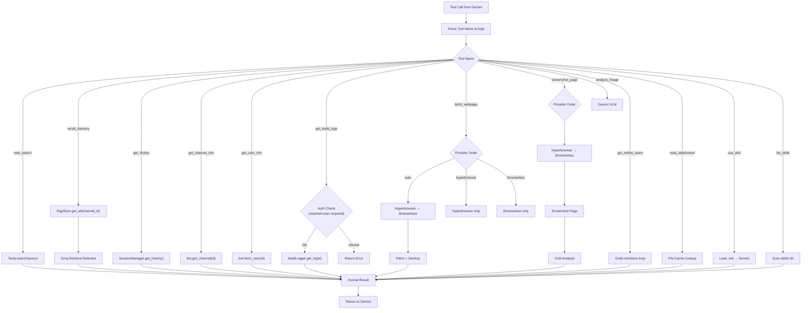

## Memory & Storage Flow

```mermaid
flowchart TD
    subgraph InMemory["In-Memory Storage"]
        SessionCache["Session Cache<br/>(channel_id → messages)"]
        MessageCache["Message Cache<br/>(message_id → data, LRU 500)"]
        FileCache["File Attachment Cache<br/>(channel_msg → contents, 100 max)"]
        TrackerCache["Tracker Dicts<br/>(channel → tool/response/fp, 200 max)"]
    end

    subgraph Persistent["Persistent Storage"]
        HistoryJSONL["data/history/*.jsonl<br/>(SHA1-hashed keys)"]
        MemoriesJSONL["data/memories/*.jsonl<br/>(with dedup + TTL)"]
        AuditJSONL["data/audit/audit.jsonl<br/>(UTC timestamps)"]
        SholatConfig["data/sholat_config.json"]
        PreferencesJSON["data/mentions/preferences.json"]
        GitRepo["data/.git (GitHub Backup)"]
    end

    subgraph Processes["Background Processes"]
        TTLPrune["TTL Prune<br/>(Daily at 3AM WIB)"]
        HistoryCleanup["History Cleanup<br/>(Weekly Sunday 4AM)"]
        BackupTrigger["Backup Trigger<br/>(Every 10 msgs / 1hr)"]
        SholatReminder["Sholat Reminder<br/>(Every 60s check)"]
    end

    MessageIn["New Message"] --> SessionCache
    MessageIn --> HistoryJSONL
    MessageIn --> AuditJSONL

    RAGExtract["RAG Extraction"] --> MemoriesJSONL

    TTLPrune --> MemoriesJSONL
    HistoryCleanup --> HistoryJSONL

    BackupTrigger --> GitRepo
    TTLPrune --> GitRepo

    SholatReminder --> SholatConfig
```

## Audit Logging Flow

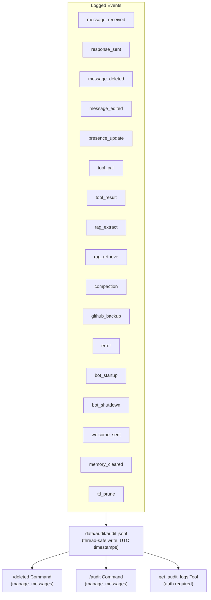

## GitHub Backup Flow

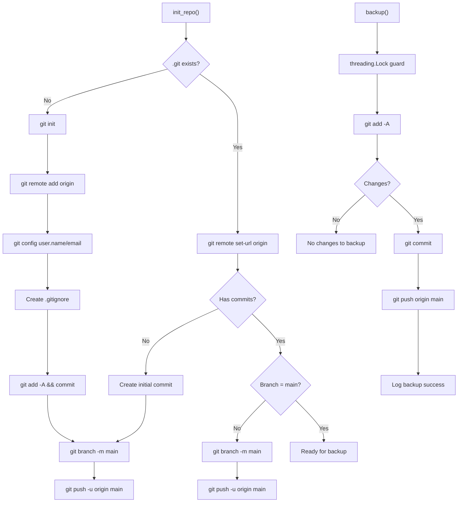

## Prompt Injection Protection (Browserless / Hyperbrowser)

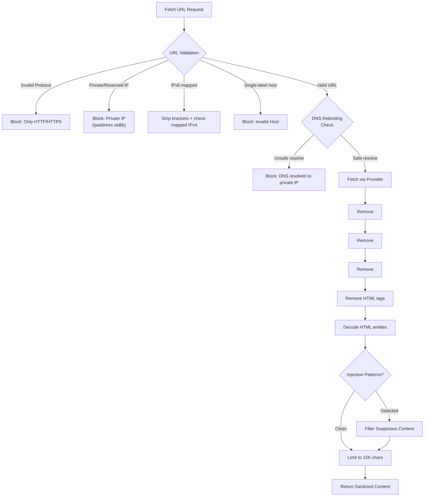

## VLM (Vision Language Model) Flow

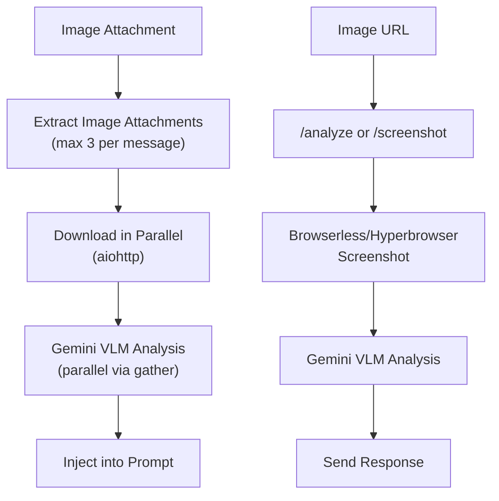

## Sholat Auto-Reminder Flow

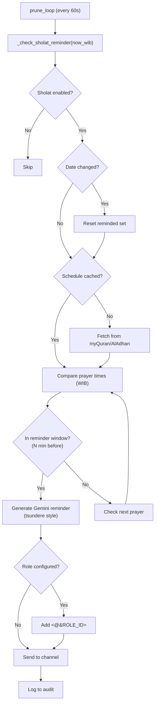

## Gemini API Key Rotation & Model Fallback

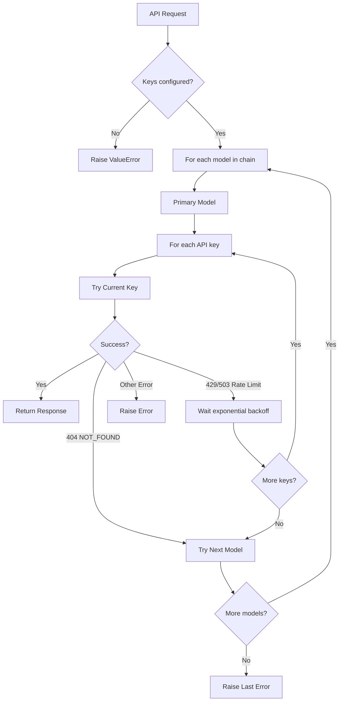
