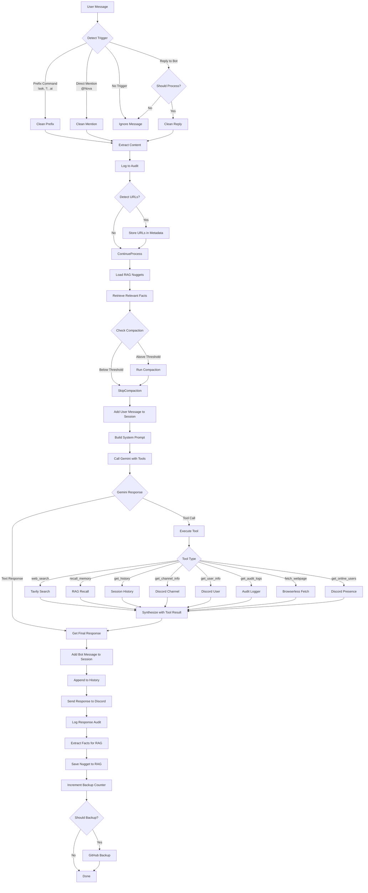
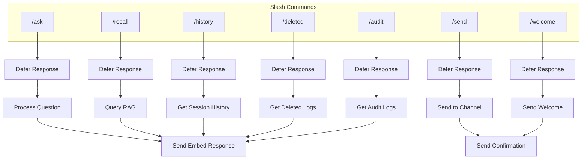
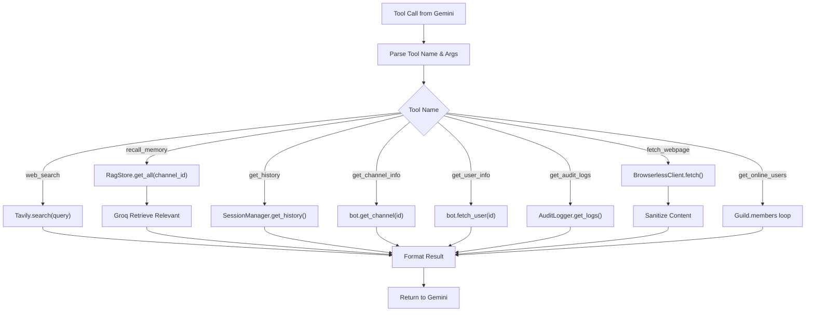
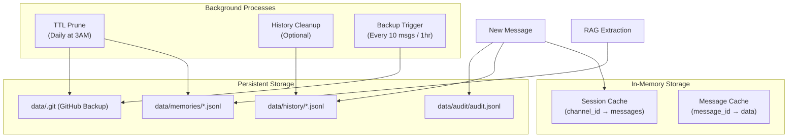
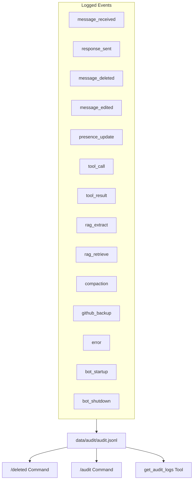
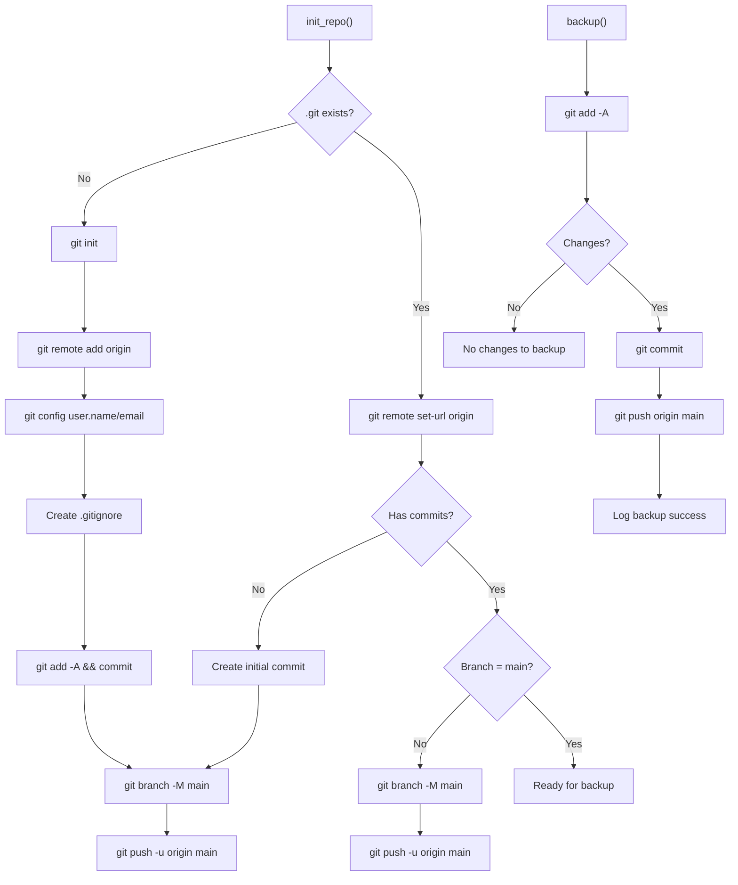
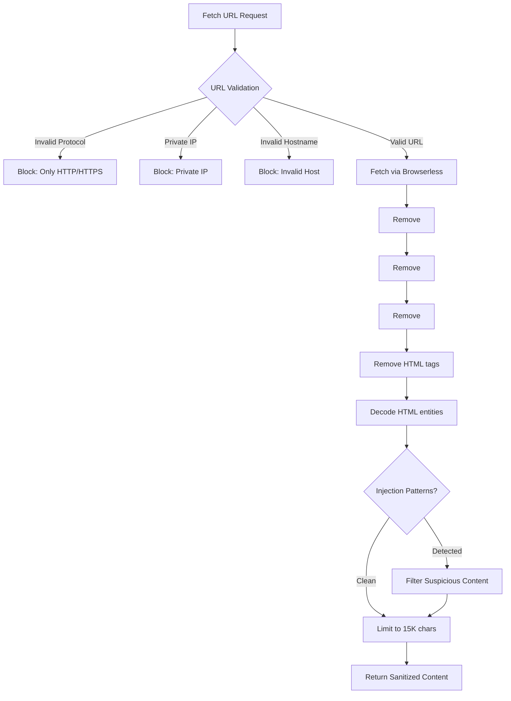
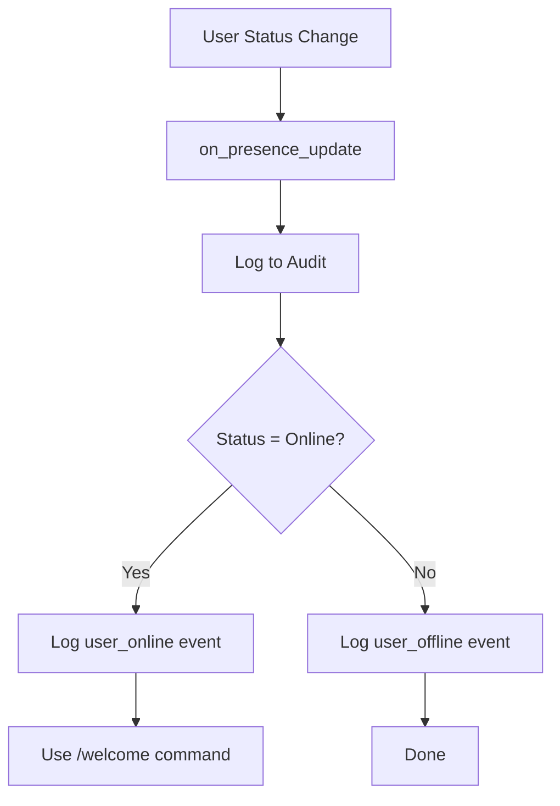
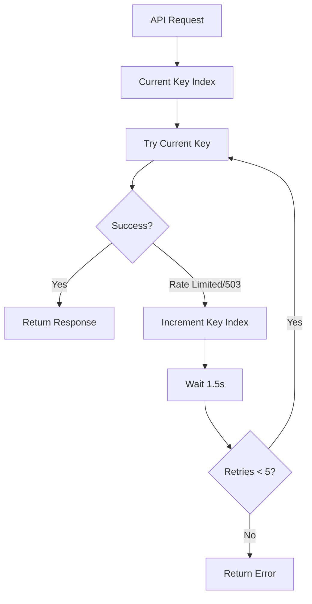

# Nova Discord Bot - Full Flowchart

## System Architecture

```mermaid
flowchart TB
    subgraph External["External Services"]
        DiscordAPI["Discord API"]
        GeminiAPI["Google Gemini API"]
        GroqAPI["Groq API"]
        TavilyAPI["Tavily API"]
        BrowserlessAPI["Browserless API"]
        GitHubAPI["GitHub API"]
    end

    subgraph BotCore["Bot Core"]
        Main["main.py"]
        Bot["core/bot.py"]
        EventHandler["core/event_handler.py"]
        MessageRouter["core/message_router.py"]
        ContextBuilder["core/context_builder.py"]
    end

    subgraph Services["Services Layer"]
        GeminiClient["services/gemini_client.py"]
        GroqClient["services/groq_client.py"]
        TavilyClient["services/tavily_client.py"]
        BrowserlessClient["services/browserless_client.py"]
        ToolExecutor["services/tool_executor.py"]
    end

    subgraph Memory["Memory Layer"]
        SessionManager["memory/session_manager.py"]
        HistoryStore["memory/history_store.py"]
        RagStore["memory/rag_store.py"]
        CompactionEngine["memory/compaction_engine.py"]
        AuditLogger["memory/audit_logger.py"]
        GitHubBackup["memory/github_backup.py"]
        ScheduledJobs["memory/scheduled_jobs.py"]
    end

    subgraph Cogs["Cogs (Discord Commands)"]
        AICogs["cogs/ai_commands.py"]
        AdminCogs["cogs/admin_commands.py"]
        DynamicPresence["cogs/dynamic_presence.py"]
        SlashCommands["cogs/slash_commands.py"]
    end

    subgraph Config["Configuration"]
        Settings["config/settings.py"]
        Personality["config/prompts/personality.txt"]
        Prefixes["config/prefixes.json"]
    end

    Main --> Bot
    Main --> Services
    Main --> Memory
    Main --> Cogs
    Main --> Config

    Bot --> DiscordAPI
    Bot --> EventHandler
    Bot --> MessageRouter

    GeminiClient --> GeminiAPI
    GroqClient --> GroqAPI
    TavilyClient --> TavilyAPI
    BrowserlessClient --> BrowserlessAPI
    GitHubBackup --> GitHubAPI

    ToolExecutor --> GeminiClient
    ToolExecutor --> GroqClient
    ToolExecutor --> TavilyClient
    ToolExecutor --> BrowserlessClient

    SlashCommands --> ToolExecutor
    SlashCommands --> AuditLogger
```

## Message Processing Flow

## Slash Commands Flow

## Tool Execution Flow

## Memory & Storage Flow

## Audit Logging Flow

## GitHub Backup Flow

## Prompt Injection Protection (Browserless)

## Presence Tracking Flow

## Gemini API Key Rotation

